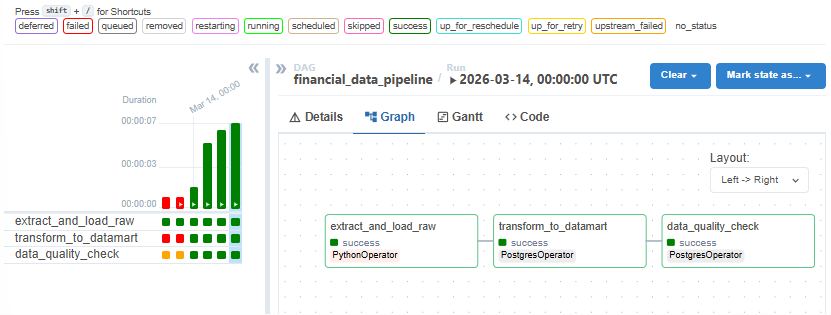
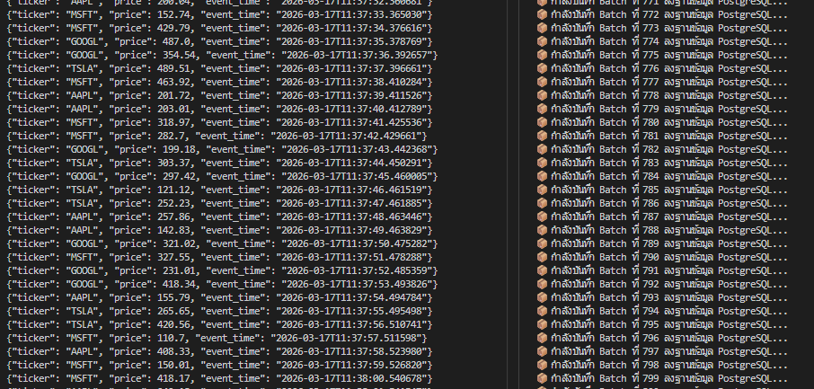
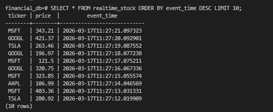

# 🚀 Financial ETL Data Pipeline: Batch & Real-Time Streaming

An end-to-end Data Engineering project demonstrating both **Batch Processing** and **Real-time Stream Processing** architectures using industry-standard tools. 

This project simulates capturing financial stock market data and processing it through a robust, scalable data pipeline deployed via Docker.

## 🏗️ Architecture Overview

The pipeline implements a simplified **Lambda Architecture**, combining a batch layer for scheduled historical data processing and a speed layer for real-time analytics.

* **Batch Layer:** Apache Airflow automates daily data extraction and transformation.
* **Speed (Streaming) Layer:** Apache Kafka ingests real-time mock stock data, while Apache Spark (PySpark) processes the data streams on the fly.
* **Storage:** PostgreSQL serves as the final destination (Data Warehouse/Database) for structured querying and downstream analytics.

*(Insert your Architecture Diagram here if available)*
---

## 🛠️ Tech Stack & Tools Used
* **Language:** Python 3.10
* **Orchestration:** Apache Airflow
* **Message Broker:** Apache Kafka / Zookeeper
* **Stream Processing:** Apache Spark (PySpark)
* **Database:** PostgreSQL
* **Containerization:** Docker & Docker Compose

---

## 🟢 Phase 1: Batch Processing with Airflow
Scheduled automated data pipelines to extract and process data on a daily basis.


*(Replace the image path above with your actual Airflow screenshot)*

---

## ⚡ Phase 2: Real-time Streaming with Kafka & Spark
Built a producer to generate mock stock data (AAPL, GOOGL, MSFT, TSLA) into a Kafka topic, and a PySpark consumer to process the micro-batches in real-time.


*(Replace the image path above with your actual Kafka/Spark Terminal screenshot)*

---

## 🗄️ Phase 3: Real-time Database Sink
Configured the Spark structured streaming job to write the processed data directly into a PostgreSQL database using JDBC drivers.


*(Replace the image path above with your actual PostgreSQL SELECT query screenshot)*

---

## 🚀 How to Run the Project

1. **Clone the repository:**
   ```bash
   git clone [https://github.com/Sutthipat D Bookky/financial-etl-project.git](https://github.com/Bookky123/financial-etl-project.git)
   cd financial-etl-project